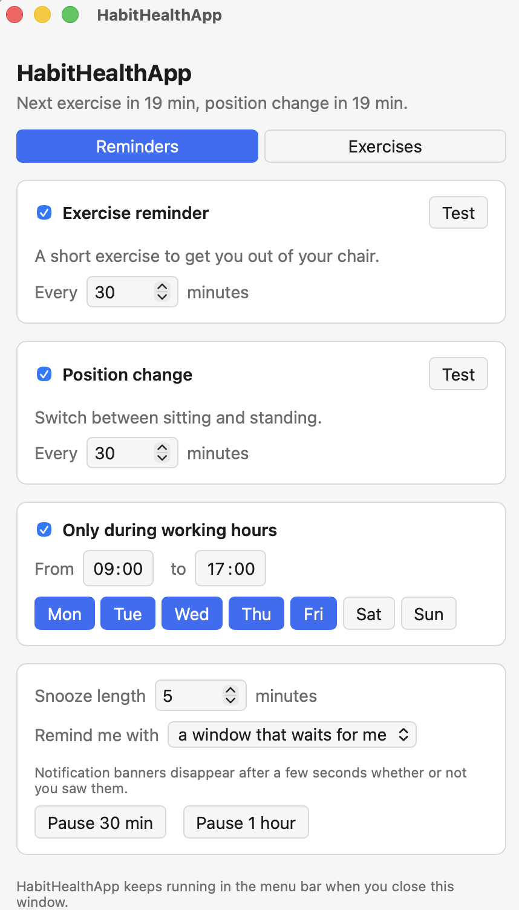
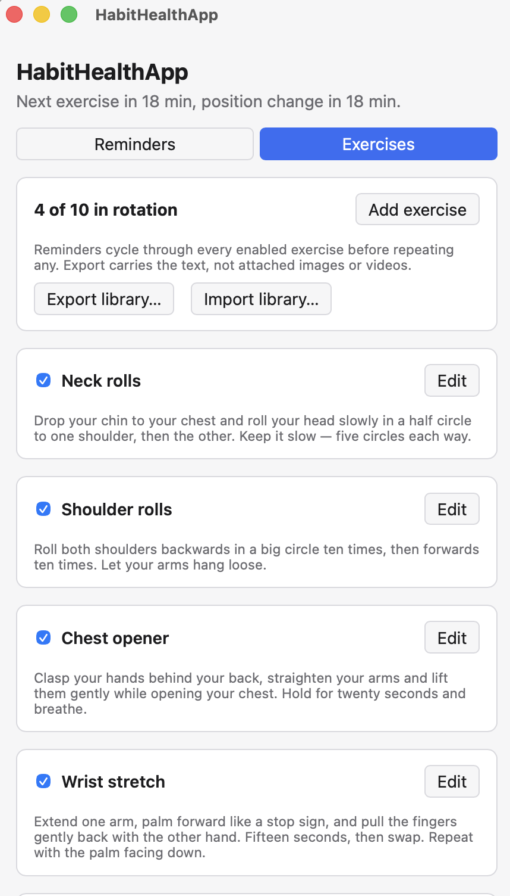
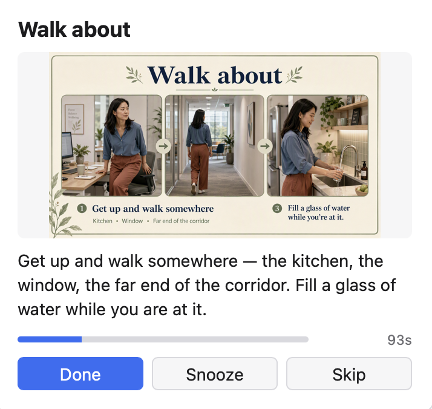
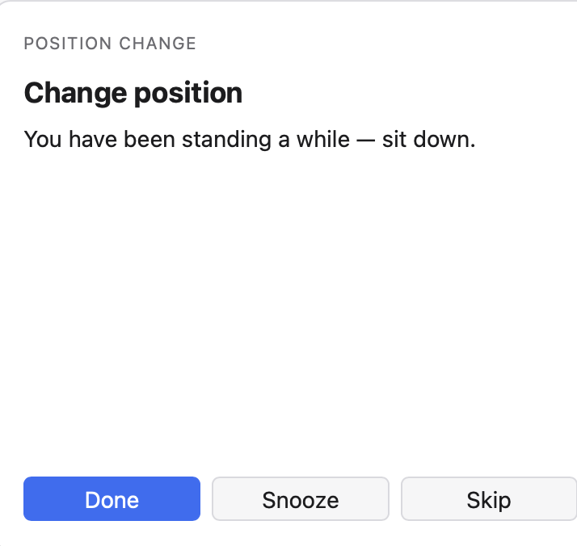

# HabitHealthApp

**Exercise and posture reminders for desk workers — a small menu bar app for
macOS, Windows and Linux.**

Desk reminders that actually interrupt you: a short exercise at an interval you
choose, and a separate nudge to switch between sitting and standing. The idea
was to keep it simple and configurable for different exercises and time
intervals.

The motivation is that office jobs lack changing positions and movement in
general, and people sit too much, which can result in health issues such as
musculoskeletal problems, screen fatigue, or cardiovascular disease. To help
prevent these, this app gives regular exercise suggestions and reminders.

It lives in the menu bar / system tray, has no Dock icon, and stays quiet
outside your working hours.

In Settings you can configure how often reminders appear, and the times and days
they are sent. Exercises can be edited, enabled and disabled, and images or
videos can be added to show how an exercise should be done:

  

Reminders appear as a pop-up that waits for an answer:

  

## Install

Download the installer for your platform from the
[latest release](../../releases/latest).

The builds are **unsigned**, so your operating system will object the first
time. This is expected — there is no code-signing certificate behind them.

| Platform | File | First launch |
|---|---|---|
| macOS | `.dmg` | Right-click the app → **Open** → **Open**. Or run `xattr -dr com.apple.quarantine /Applications/HabitHealthApp.app` |
| Windows | `.msi` or `.exe` | "Windows protected your PC" → **More info** → **Run anyway** |
| Linux | `.AppImage` or `.deb` | `chmod +x` the AppImage, or `sudo dpkg -i` the .deb |

You only have to do this once, not on every launch.

## Using it

- **Menu bar icon** — shows whether you are sitting or standing and the
  countdown to the next reminder. From there you can trigger a reminder
  immediately, pause for 30 minutes / 1 hour / until tomorrow, open Settings,
  or quit.
- **Settings → Reminders** — intervals for each reminder, working hours and
  weekdays, snooze length, and whether reminders arrive as a pop-up window or a
  system notification.
- **Settings → Exercises** — add, edit, enable and disable exercises. Reminders
  cycle through every enabled exercise before repeating any, so you are not
  given the same one twice in a row.

Closing the Settings window does not quit the app; it keeps running in the menu
bar. Quit deliberately from the menu bar icon.

### Working hours

Outside your working hours the app is deliberately silent — no reminders in the
evening or at weekends. The working-hours card in Settings tells you when this
is why nothing is firing. The **Test** button ignores working hours, so you can
always check a reminder looks right.

### Images and videos

The ten built-in exercises come with illustrations, so the app is useful the
moment you install it.

To use your own, edit an exercise and choose **Add image or video…**. The file
is *copied* into the app, so you can move or delete the original afterwards
without breaking anything. Attaching your own file to a built-in exercise simply
replaces the supplied illustration.

Supported: `png`, `jpg`, `gif`, `webp`, `avif` for images, and `mp4`, `m4v`,
`mov`, `webm` for video. Anything else is refused when you attach it, rather
than showing a blank box later. Video plays muted and looped — a demonstration
to copy, not something to sit and watch. Prefer `mp4` for video; `webm` support
on macOS is patchy.

### Sharing exercises with colleagues

**Export library…** writes your exercises to a JSON file and **Import library…**
reads one back. Send that file to a colleague and they get your set. There is no
server or account involved.

The export carries the exercise text only, **not** attached images or videos. A
colleague importing your library gets the exercises without your media.

### Your data

Settings and exercises are plain JSON files, and attached media sits beside
them, in:

- **macOS** — `~/Library/Application Support/io.github.andererka.habithealthapp/`
- **Windows** — `%APPDATA%\io.github.andererka.habithealthapp\`
- **Linux** — `~/.local/share/io.github.andererka.habithealthapp/`

Copy that folder to back up or move your library to another machine. Nothing is
sent anywhere.

## Troubleshooting

### I cannot find the menu bar icon

**Launch the app again.** It will not start a second copy — it brings the
Settings window to the front instead. That is the reliable way back in whenever
the icon is hidden.

macOS hides menu bar icons when too many apps compete for the space, and on
laptops with a notch they can end up underneath it. Holding **⌘** while dragging
menu bar icons lets you reorder them so this one sits where you will find it.

### Reminders never appear

Check the working hours in Settings — outside them the app stays silent on
purpose. If the **Test** button shows a reminder but scheduled ones never
arrive, working hours are almost certainly the reason.

### Notifications do not show up (macOS)

If you chose notification-style reminders rather than the pop-up window, set the
alert style to **Alerts** rather than Banners in System Settings →
Notifications → HabitHealthApp. Banners disappear after a few seconds whether or
not you noticed them.

The default pop-up window style avoids this entirely, and is recommended.

## Known limitations

- **The builds are unsigned**, so the first launch needs the click-through
  above. Signing them properly requires a paid Apple developer account and a
  Windows code-signing certificate.
- **No automatic updates.** A new version means downloading it again.
- **Library export does not include media files**, only the exercise text.

## Licence

[MIT](LICENSE) — use it, fork it, change it. If it is useful to your team,
take it.

---

Building it yourself or contributing? See [DEVELOPMENT.md](DEVELOPMENT.md).
